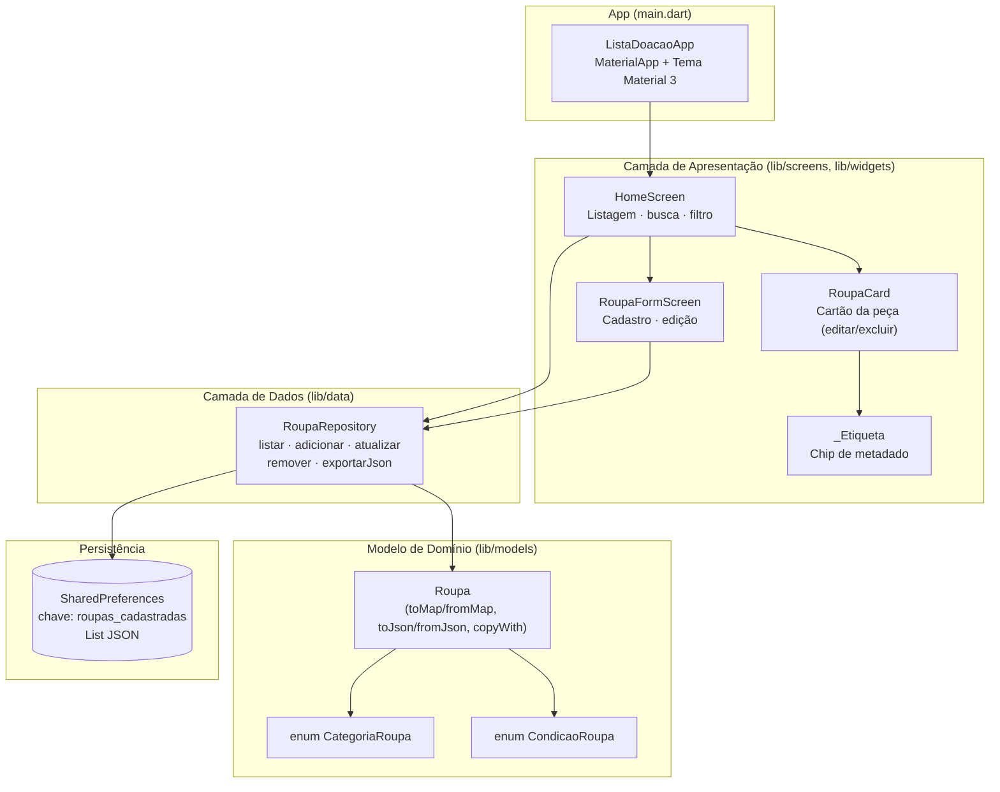
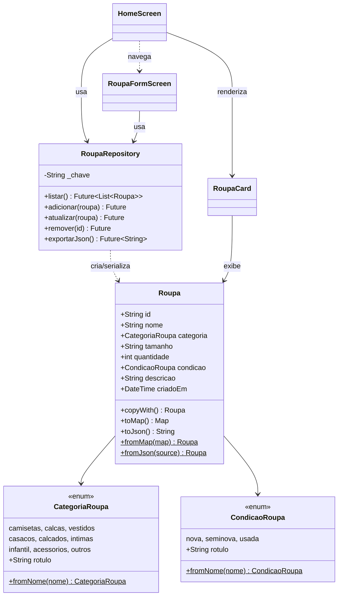
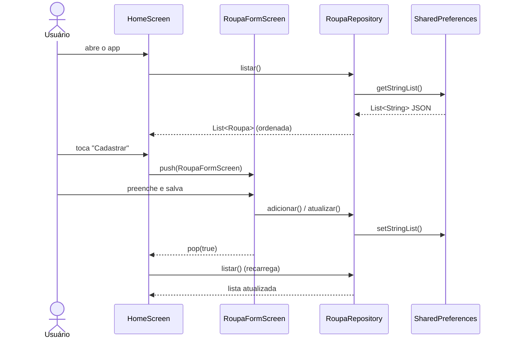

# Diagrama de Arquitetura — Lista de Doação de Roupas

Aplicativo Flutter para organização de roupas destinadas à doação (cadastro,
edição, exclusão, listagem, busca e filtro por categoria), com persistência
local via `SharedPreferences`.

## 1. Arquitetura em camadas

## 2. Relacionamento entre classes

## 3. Fluxo principal (cadastro / edição)

